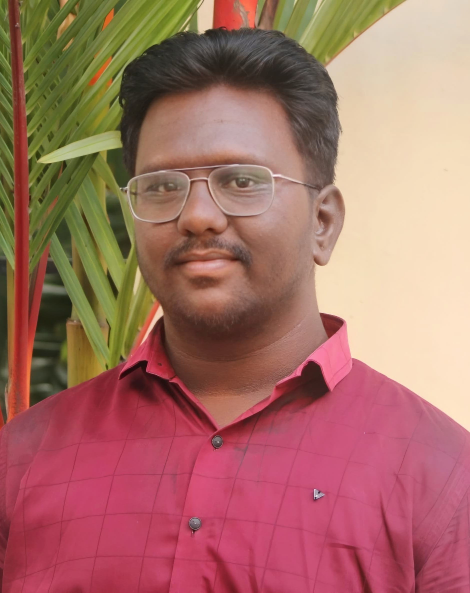

# Arunpandian C Portfolio

A modern, fully responsive portfolio website built with Next.js, React, and Tailwind CSS to showcase the skills, projects, and achievements of Arunpandian C.

# Deployed website:
https://arun-portfolio-plum.vercel.app/

## 🚀 Features

- **Responsive Design:** Looks great on all devices (desktop, tablet, mobile)
- **Animated UI:** Smooth transitions and interactive elements
- **Skills Showcase:** Visual display of tech stack and soft skills
- **Project Highlights:** Brief descriptions of key projects
- **Education & Experience:** Academic background and achievements
- **Contact Section:** Easy ways to get in touch
- **Downloadable Resume:** Quick access to CV

## 🛠️ Tech Stack

- [Next.js](https://nextjs.org/)
- [React](https://react.dev/)
- [Tailwind CSS](https://tailwindcss.com/)
- [Lucide Icons](https://lucide.dev/)

## 📁 Folder Structure

```
arun-portfolio/
├── app/                # Main app pages and layout
├── components/         # Reusable UI components
├── hooks/              # Custom React hooks
├── lib/                # Utility functions
├── public/             # Static assets (images, resume, etc.)
├── styles/             # Global styles
├── README.md           # Project documentation
├── package.json        # Project dependencies
└── ...
```

## 🖥️ Getting Started

1. **Clone the repository:**
   ```bash
   git clone https://github.com/arunpandian9159/arun-portfolio.git
   cd arun-portfolio
   ```
2. **Install dependencies:**
   ```bash
   npm install
   # or
   pnpm install
   ```
3. **Run the development server:**
   ```bash
   npm run dev
   # or
   pnpm dev
   ```
4. **Open in your browser:**
   Visit [http://localhost:3000](http://localhost:3000)

## 📸 Screenshots

> 

## 📄 Resume

- [Download Resume](public/Resume.docx)

## 🙋‍♂️ Contact

- **Email:** arunpandiancse25@gmail.com
- **LinkedIn:** [Arunpandian C](https://www.linkedin.com/in/Arunpandian-C)
- **GitHub:** [arunpandian9159](https://github.com/arunpandian9159)

---

> © 2024 Arunpandian C. All rights reserved. Built with passion and creativity.
